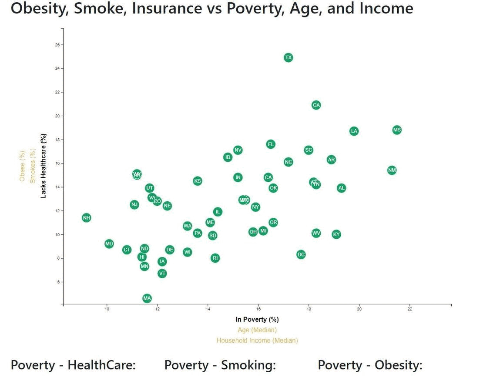
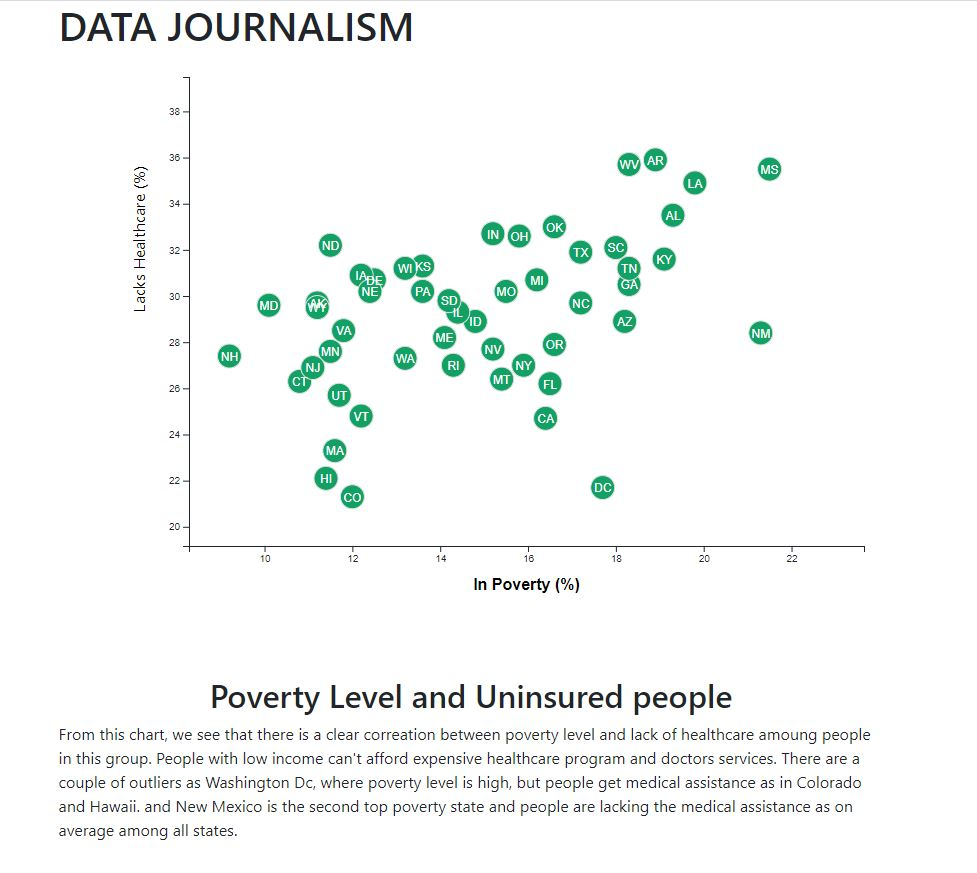

#Data_Journalism
Folder: D3_data_journalism_bonus

More Data, More Dynamics

It includes more demographics and more risk factors. 
with additional labels in a scatter plot.
There are click events so that users can decide which data to display. 
Transitions are animated for the circles' locations as well as the range of axes. 
There are three risk factors for each axis. 
Tooltips display the data that the user has selected.

Folder: D3_data_journalism

A scatter plot that represents each state with circle elements. 

*****************************************************************
You'll need to use python -m http.server to run the visualization. 
This will host the page at localhost:8000 in your web browser.

*****************************************************************